# Deep Learning-Based Analysis of CT Images in Pancreatic Adenocarcinoma Patients

This project was conducted through machine learning and programming classes at Yonsei University.

## Table of Contents  

[1. Problem formulation](#1)
 * [1.1 Motivation](#11)
 * [1.2 Goal of project](#12)
 * [1.3 About prior study](#13)
 
[2. Dataset](#2)
 * [2.1 Public data](#21)
 * [2.2 Data preprocessing](#22)
 * [2.3 Data augmentation](#23)
 * [2.4 Using balanced weights](#24)

[3. Models](#3)
 * [3.1 Semantic segmentation models](#31)
 * [3.2 U-NET](#32)
 * [3.3 DeepLabV3+](#33)

[4. Results](#4)
 * [4.1 Experimental results](#41)
 * [4.2 Segmented area quantification](#42)

[5. Conclusion](#5)
 
[6. Future work](#6)
 * [6.1 Applying to read data](#61)
 * [6.2. 3d model](#62)

[7. How to use](#7)
 * [7.1 Setup](#71)
 * [7.2 Training](#72)
 * [7.3 Evalutaion](#73)

[8. Reference](#8)

## Problem formulation <a name="1"></a>


* ### Motivation <a name="11"></a>

  Cancer cachexia is a multifactorial syndrome characterized by ongoing loss of skeletal muscle and fat. 

  Because pancreatic cancer patients with cachexia have much shorter survival time than those without cachexia, early diagnosis of cancer cachexia is crucial. Criteria for         cachexia include low BMI, extreme weight loss, and muscle/fat wasting. 

  While height, weight, and BMI are easily obtainable, muscle and fat mass requires more complicated analysis of a CT scan at the level of the third vertebra (L3).

  Therefore, if we develop an algorithm which can segment muscles and fat through ct images and calculate each mass and volume to diagnose cancer cachexia, it's a great help in    early diagnosis of cancer cachexia and, as a result, it's a great contribution to prolonging the lives of patients.

* ### Goal of project <a name="12"></a>
  Our goal of project is as follows. 

  1. Segment muscle and fat from CT images and compare with ground truth image
  2. Calculate each mass and volume 
  3. Developing an algorithm which can diagnose cancer cachexia from the segmented images and calculated mass and volume
  
* ### About prior study <a name="13"></a>

  Prior to proceed with the project, prior studies were investigated.

## Dataset <a name="2"></a>


  Basically, segmentation tasks require ct images and corresponding labeled images. In addition, this project also requires information about mass and volumes for each segmented   class. 

  Since exportation of real data is not approved by IRB, we deciede to use public data instead.

* ### Public data <a name="21"></a>

  We decided to train a model via public dataset and apply our trained model to real data later.

  Public dataset was selected considering its similarity to real data.

  * #### Public data description <a name="211"></a>

    This dataset consists of 140 computed tomography (CT) scans, each with five organs labeled in 3D: lung, bones, liver, kidneys and bladder. The brain is also labeled on the minority of scans which show it.

  Since the goal of our project is to segment two classes, we decided to use only two of the five classes in public dataset.

  About 7000 images were used for training and split by 7:2:1


  [Public Dataset Link](https://wiki.cancerimagingarchive.net/display/Public/CT-ORG%3A+CT+volumes+with+multiple+organ+segmentations)


* ### Data preprocessing <a name="22"></a>
  We proceed with data pre-processing before training the model.
  Images were resized to reduce computational cost while maintaing minimum resolution.
  The original resolution was 512, 512 and the resized resolution was 256, 256.

  For similarity to real data and to avoid unnecessary loss calculation, only two classes of liver and lung are extracted.
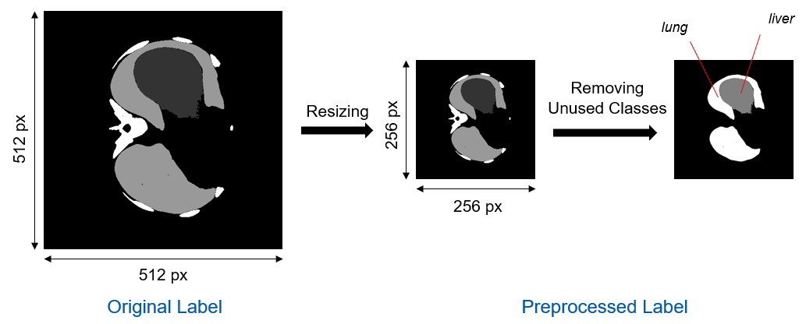
  
* ### Data Augmentation <a name="23"></a>

  To increase the diversity of data, data augmentation is also taken.
  Considering characteristics of the data, CLAHE[1] and vertical flipping were applied using OPENCV.
  
  * #### CLAHE
    CLAHE(Contrast Limited Adaptive Histogram Equalization) is an image processing technique that adds climlimit to AHE. AHE may cause noise to be amplified in near constant regions. By adding cliplimit, we can solve noise problems.
    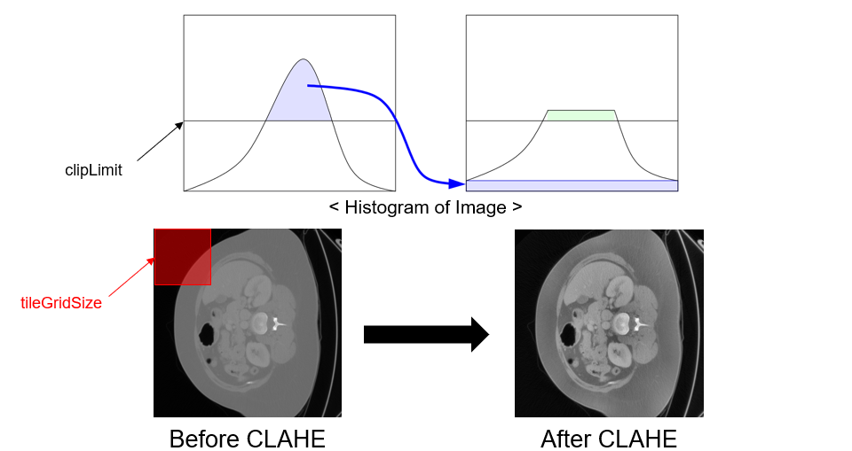
    
  * #### Augmented images
    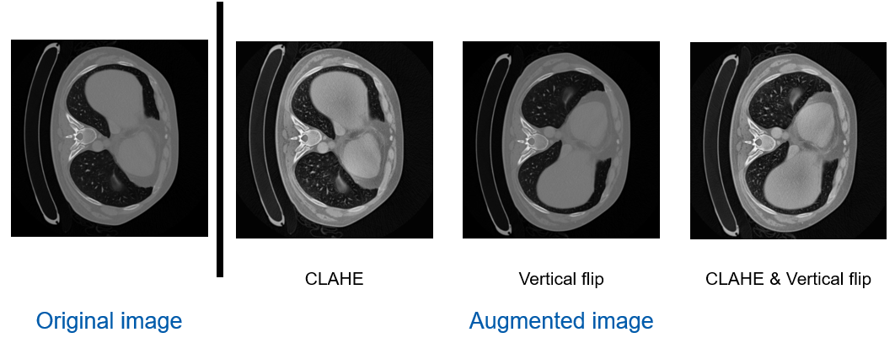
    
* ### Using balanced weights <a name="24"></a>

Since data imbalance of each class exists(background is dominant), our model tends to predict everything black. We verified that different weights are needed for each class. 
We have calculated weights based on different frequencies of each class. 

By the following formular[2], custom weights were calculated.

  


## Models <a name="3"></a>

In this project, two models were tested considering their feasibility and accuracy. 

* ### Semantic segmentation models <a name="31"></a>

  We decided to implement and validate the U-NET[4] and DepLabV3+[5] models with reference to the timeline and accuracy[3] of the semantic segmentation models.
  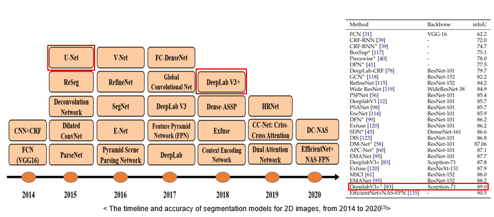
  
* ### U-NET <a name="32"></a>
  U-Net is a one of convolutional network for biomedical image segmentation.
  Segmentation with end-to-end makes the model lighter, faster converge, and less computational cost.
  The structure of the overall model is called U-NET because it resembles the alphabet U.
  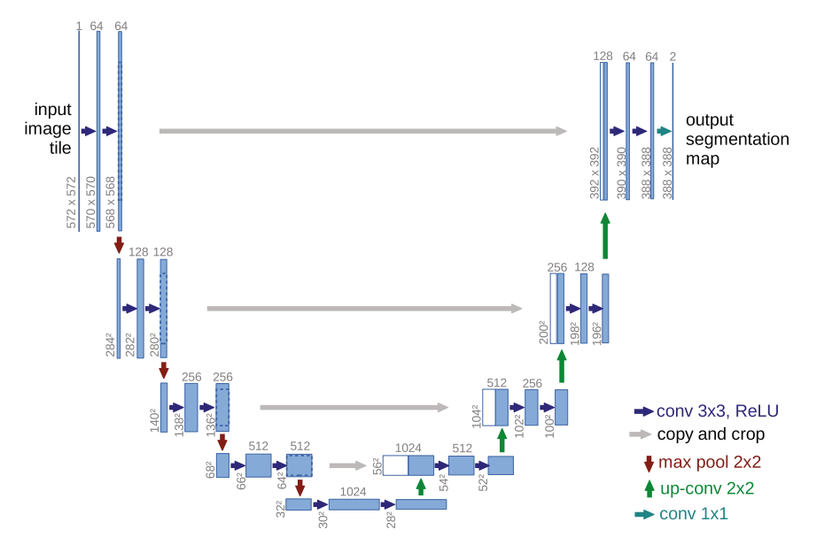
  

* ### DeepLabV3+ <a name="33"></a>
  DeepLabV3+ shows relatively high accuracy and compared to similar performance models, the computational cost is low.
  For these reasons, we decided to use **DeepLabV3+** model in this project. 
  DeepLabV3+ model shows good performance in segmentation tasks because of several features as below.
  
  * #### Atrous convolution
    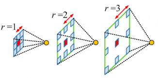
    
    Insert zeros or “hole” between the kernel of convolutional layers to enhance the image resolution

  * #### Atrous Spatial Pyramid Pooling (ASPP)
    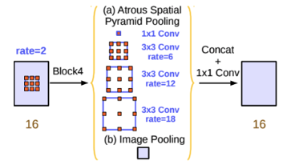
    
    Apply & combine atrous convolutions with different rates in parallel

  * #### Depthwise Separable Convolution
    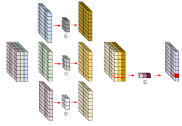
    
    Apply the kernel to each individual channel layer only. After disconnecting the channel axis, replace the channel axis with multiple convolution filters that always have a length of 1.
  
  

## Results <a name="4"></a>


* ### Experimental results <a name="41"></a>
  We constructed 5 experiment cases according to which model is used and whether the data augmentation process is conducted. It was shown that DeeplabV3+ model performed better than U-Net and data augmentation improved the segmentation accuracy. U-NET model was trained on colab, using Tesla K80 and DeepLabV+ model was trained on server, using RTX 3090.
  
  * #### Class1 is Liver and Class2 is Lung and number of patients is 5.
  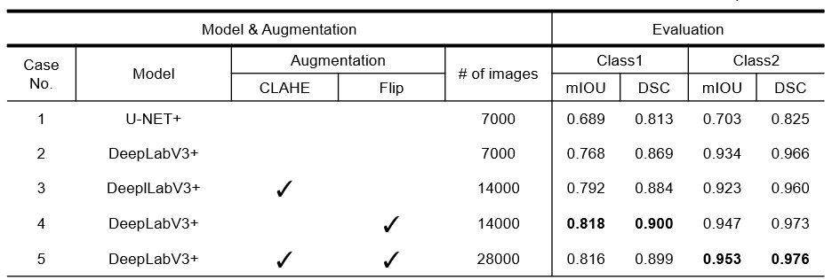
  
  * #### We also compared the results from five cases qualitatively. The case 5 result was most similar to the corresponding groud-truth.
  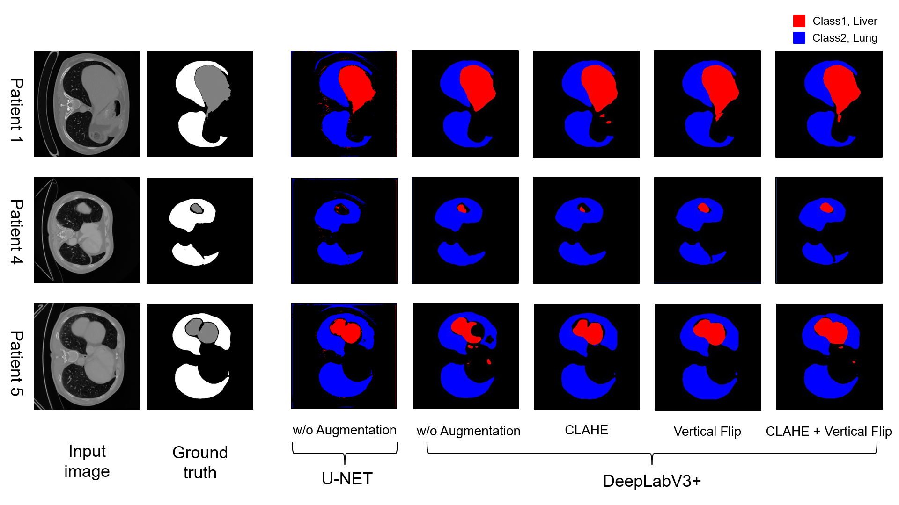
  
* ### Segmented area quantification <a name="42"></a>
  We also quantified the segmented class area in real scale. Because it was not possible to validate the area quantification with the public data, we just present this quantification method. Since Real data include sapcing information, we can apply this method. We first counted the number of pixels for each segmented class, and then, we multiplied it by pixel spacing.
  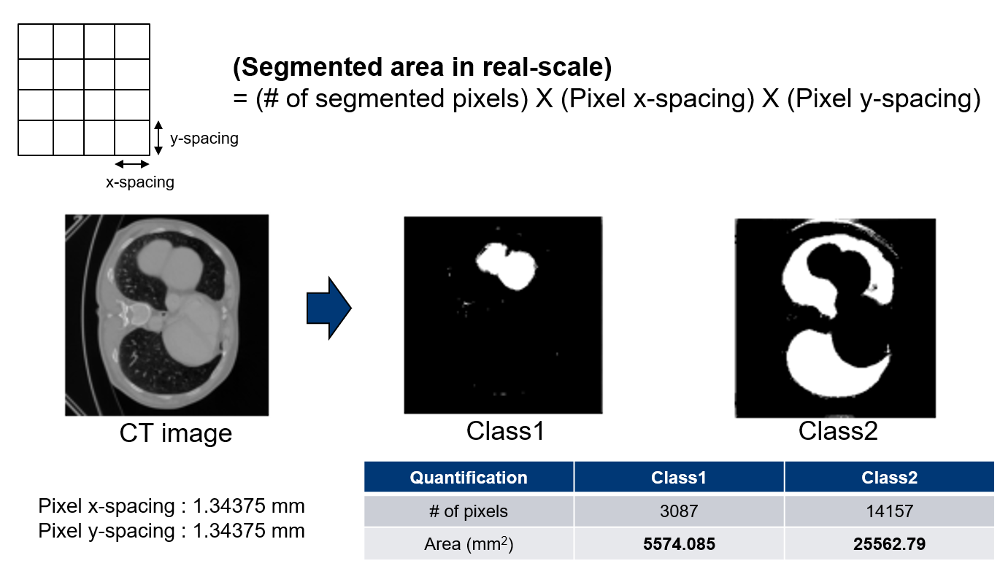
  


## Conclusion <a name="5"></a>

* ### In this project, we conducted segmentation using two models and improved the performance of the model through data augmentation
    We confirmed that DeepLabV3+ shows higher accuracy than U-NET.
    We confirmed that data augmentation improves accuracy of the model.
* ### Through the predicted segmentation images(L3), we predict area of each class
    If real data is available later, the same process could be applied to predict segmentation, volume and mass of each class.
    Public data was not able to validate because there was no information about actual volume, mass and area.
    But it can be possible to validate the real data since it contains information about real volume, mass and area of each class.
 
* ### Due to data problems and limited time, relatively small dataset was used
    As we’ve seen with data augmentation, we expect to get better accuracy with larger dataset.


## Future work <a name="6"></a>

* ### Applying to real data <a name="61"></a>
   If real data is available later, we would like segment the image and validate it by applying our trained model.
   Through segmented images, we would like to predict and validate the volume and mass of each class.
   If the volume and mass prediction performs well, we could utilize the result to train diagnosis algorithm for cancer cachexia. 

* ### 3D Model <a name="62"></a>
    Since only L3 images are available in real data, we haven’t tried 3D model.
    If images other than L3 are available in real data, we would like to train the 3D models and compare the accuracy with the 2D models.


## How to use <a name="7"></a>


* ### Setup <a name="71"></a>


  * #### Requirements <a name="711"></a>
    Python 3.8 or later with all [requirements.txt](requirements.txt) dependencies installed, including torch>=1.7. To install run:
    ```Python
    $ pip install -r requirements.txt
    ```


  * #### Directory settings <a name="712"></a>
    * ##### Training
    ```bash
    └── data
        ├── images
        │   ├── test
        │   │   └──image1.png
        │   ├── train
        │   │   └──image2.png
        │   └── val
        │       └──image3.png
        └── labels
            ├── test
            │   └──image1.png
            ├── train
            │   └──image2.png
            └── val
                └──image3.png
    ``` 
    * ##### Test(Onyl test data)
    ```bash
    └── data
        ├── images
        │   └── test
        │       ├── image1.png
        │       ├── image2.png
        │       └── image3.png
        └── labels
            └── test
                ├── image1.png
                ├── image2.png
                └── image3.png
    ```
* ### Training <a name="72"></a>
  ```Python
    $ python3 train.py --dataset datasetname        # dataset for training
                       --use-balanced-weights       # for using balanced weights
                       --lr  ex)0.001               # learning rate
                       --resume path/to/checkpoint  # resume training
  ```


* ### Evalutaion <a name="73"></a>
  ```Python
    $ python3 test.py --dataset datasetname            # dataset for test
                      --checkpoint path/to/checkpoint  # trained model checkpoint
                      --outpath path/for/imsave        # directory for predicted images
  ```

## Reference <a name="8"></a>

* ### [1] Reza, A. M. (2004). Realization of the contrast limited adaptive histogram equalization (CLAHE) for real-time image enhancement
* ### [2] Paszke, Adam, et al. (2016). Enet: A deep neural network architecture for real-time semantic segmentation
* ### [3] Minaee, Shervin, et al. (2021). Image segmentation using deep learning: A survey
* ### [4] Ronneberger, O., Fischer, P., & Brox, T. (2015). U-net: Convolutional networks for biomedical image segmentation
* ### [5] Chen, L. C., Zhu, Y., Papandreou, G., Schroff, F., & Adam, H. (2018). Encoder-decoder with atrous separable convolution for semantic image segmentation


Use the package manager [pip](https://pip.pypa.io/en/stable/) to install foobar.

```bash
pip install foobar
```

## Usage

```python
import foobar

foobar.pluralize('word') # returns 'words'
foobar.pluralize('goose') # returns 'geese'
foobar.singularize('phenomena') # returns 'phenomenon'
```

## Contributing
Pull requests are welcome. For major changes, please open an issue first to discuss what you would like to change.

Please make sure to update tests as appropriate.

## License
[MIT](https://choosealicense.com/licenses/mit/)

- 📫 How to reach me **inwookoh@yonsei.ac.kr**


<h3 align="left">Languages and Tools:</h3>
<p align="left"> <a href="https://opencv.org/" target="_blank">  </a> <a href="https://www.python.org" target="_blank">  </a> <a href="https://pytorch.org/" target="_blank">  </a> </p>
